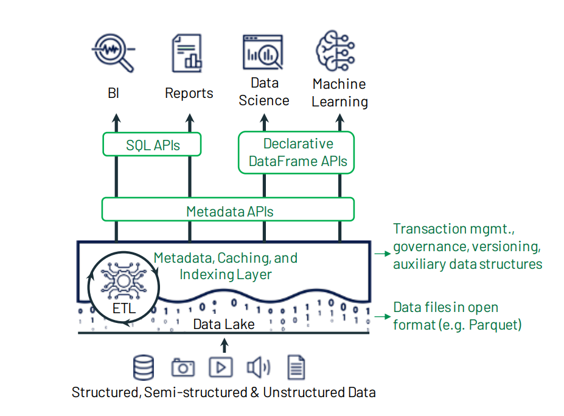

  <h1 align="center">DeltaLake湖仓存储</h1>
  

    <a href="README.md"><strong>English</strong></a> | <strong>简体中文</strong>
  

## 目录

- [仓库简介](#项目介绍)
- [前置条件](#前置条件)
- [镜像说明](#镜像说明)
- [获取帮助](#获取帮助)
- [如何贡献](#如何贡献)

## 项目介绍
[DeltaLake](https://github.com/delta-io/delta) Delta Lake 是一个开源的存储层，它构建在现有数据湖（如基于 Hadoop Distributed File System (HDFS)、Amazon S3、Azure Data Lake Storage 等）之上，为数据湖带来了可靠性、事务性和 ACID（原子性、一致性、隔离性、持久性）特性。

**核心特性：**
1. ACID事务保证：Delta Lake通过多版本并发控制（MVCC）机制实现完整的ACID事务。
2. 可扩展的元数据管理：Delta Lake利用Spark的分布式处理能力来处理PB级表的元数据，支持数十亿文件的元数据管理。
3. 流批处理统一：Delta表同时作为批处理表和流式源与接收器，实现真正的流批一体。
4. 时间旅行（Time Travel）：Delta Lake支持数据版本控制，允许查询历史数据快照。
5. 充满活力的连接器生态系统：Delta Lake拥有从各种数据处理引擎读取和写入Delta表的连接器，如Apache Spark、Apache Flink、Apache Hive、Apache Trino。

**架构设计：**

本项目提供的开源镜像商品 [**DeltaLake湖仓存储**](https://marketplace.huaweicloud.com)，已预先安装 DeltaLake 软件及其相关运行环境，并提供部署模板。快来参照使用指南，轻松开启“开箱即用”的高效体验吧。

> **系统要求如下：**
> - CPU: 4GHz 或更高
> - RAM: 8GB 或更大
> - Disk: 至少 60GB

## 前置条件
[注册华为账号并开通华为云](https://support.huaweicloud.com/usermanual-account/account_id_001.html)

## 镜像说明

| 镜像规格                                                                                                                | 特性说明                                         | 备注 |
|---------------------------------------------------------------------------------------------------------------------|----------------------------------------------| --- |
| [deltaLake4.0.0-kunpeng-v1.0](https://github.com/HuaweiCloudDeveloper/DeltaLake-image/tree/deltaLake4.0.0-kunpeng-v1.0) | 基于 鲲鹏服务器 + Huawei Cloud EulerOS 2.0 64bit 安装部署 |  |

## 获取帮助
- 更多问题可通过 [issue](https://github.com/HuaweiCloudDeveloper/DeltaLake-image/issues) 或 华为云云商店指定商品的服务支持 与我们取得联系
- 其他开源镜像可看 [open-source-image-repos](https://github.com/HuaweiCloudDeveloper/open-source-image-repos)

## 如何贡献
- Fork 此存储库并提交合并请求
- 基于您的开源镜像信息同步更新 README.md
