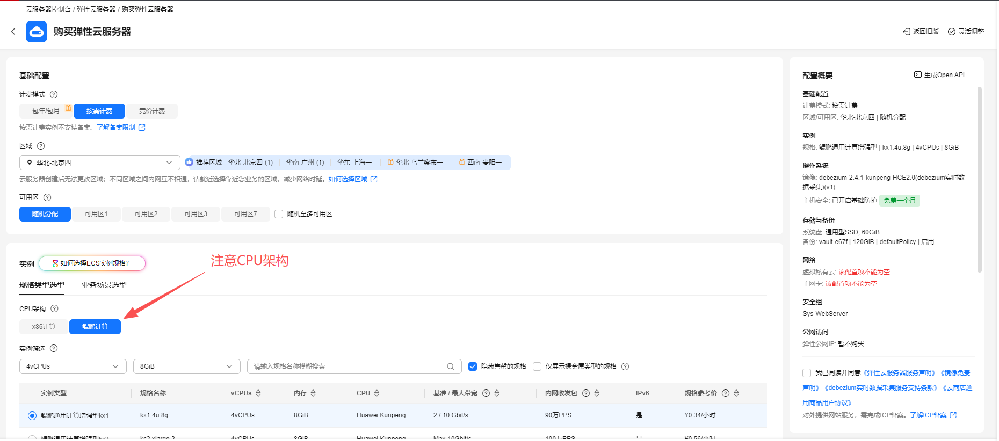
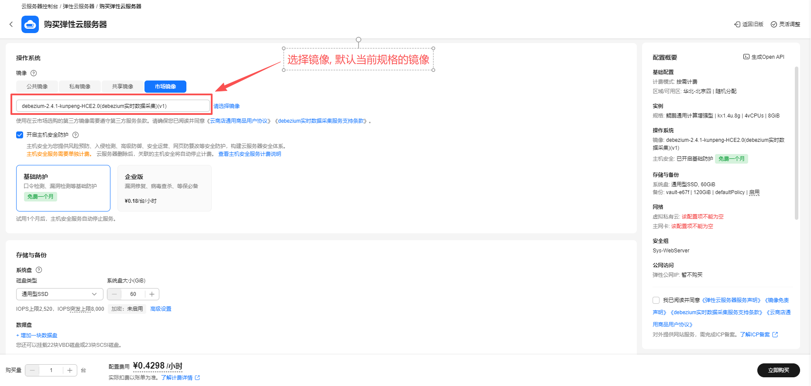
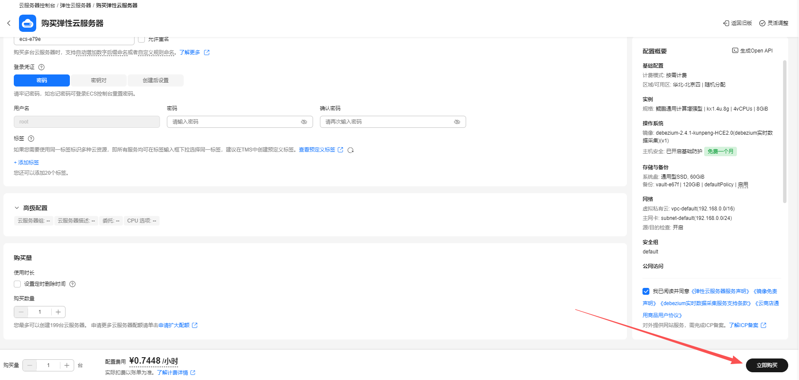

# DeltaLake使用指南

# 一、商品链接

[DeltaLake湖仓存储](https://marketplace.huaweicloud.com)

# 二、商品说明
**DeltaLake** 是一个开源的存储层，它构建在现有数据湖（如基于 Hadoop Distributed File System (HDFS)、Amazon S3、Azure Data Lake Storage 等）之上，为数据湖带来了可靠性、事务性和 ACID（原子性、一致性、隔离性、持久性）特性。

# 三、商品购买

您可以在云商店搜索 **DeltaLake湖仓存储**。

其中，地域、规格、推荐配置使用默认，购买方式根据您的需求选择按需/按月/按年，短期使用推荐按需，长期使用推荐按月/按年，确认配置后点击“立即购买”。


## 3.1 使用 RFS 模板直接部署

必填项填写后，点击 下一步


创建直接计划后，点击 确定


点击部署，执行计划

如下图“Apply required resource success. ”即为资源创建完成


##  3.2 ECS 控制台配置

### 准备工作

在使用ECS控制台配置前，需要您提前配置好 **安全组规则**。

> **安全组规则的配置如下：**
> - 入方向规则 放通4040,4041,7077 端口,如指定ip,对应的源地址内必须包含您的客户端ip，否则无法访问 
> - 入方向规则放通 CloudShell 连接实例使用的端口 `22`，以便在控制台登录调试
> - 出方向规则一键放通

### 创建ECS

前提工作准备好后，选择 ECS 控制台配置跳转到[购买ECS](https://support.huaweicloud.com/qs-ecs/ecs_01_0103.html) 页面，ECS 资源的配置如下图所示：

选择CPU架构

选择服务器规格

选择镜像

其他参数根据实际情况进行填写，填写完成之后，点击立即购买即可



> **值得注意的是：**
> - VPC 您可以自行创建
> - 安全组选择 [**准备工作**](#准备工作) 中配置的安全组；
> - 弹性公网IP选择现在购买，推荐选择“按流量计费”，带宽大小可设置为5Mbit/s；
> - 高级配置需要在高级选项支持注入自定义数据，所以登录凭证不能选择“密码”，选择创建后设置；
> - 其余默认或按规则填写即可。

# 四、商品使用

## 修改服务器域名
```shell
vim /etc/hosts
192.168.0.X ecs-0000  修改成本机服务器ip及对应ecs名称
```

## 进入delta lake python3虚拟环境
```shell
source /delta_env/bin/activate
```

## 启动SparkSubmit服务
```shell
cd /delta_env
pyspark --packages io.delta:delta-spark_2.13:4.0.0 \
  --conf "spark.sql.extensions=io.delta.sql.DeltaSparkSessionExtension" \
  --conf "spark.sql.catalog.spark_catalog=org.apache.spark.sql.delta.catalog.DeltaCatalog"
```
* 在另外一个会话窗口 使用jps检查服务是否启动  
2448 SparkSubmit  
2553 Jps  

```python
import pyspark
from delta import *

builder = pyspark.sql.SparkSession.builder.appName("MyApp") \
    .config("spark.sql.extensions", "io.delta.sql.DeltaSparkSessionExtension") \
    .config("spark.sql.catalog.spark_catalog", "org.apache.spark.sql.delta.catalog.DeltaCatalog")

spark = configure_spark_with_delta_pip(builder).getOrCreate()
```

## 进行delta表操作
* 创建delta表并写入数据(镜像当中已存在 "delta-table" 的表名 可跳过本步骤或改用其它表名)
```python
data = spark.range(0, 5)
data.write.format("delta").save("/tmp/delta-table")
```

* 查看delta表数据
```python
df = spark.read.format("delta").load("/tmp/delta-table")
df.show()
```


* 更新delta表数据(以overwrite 全覆盖的方式)
```python
data = spark.range(5, 10)
data.write.format("delta").mode("overwrite").save("/tmp/delta-table")
```

* 有条件地更新delta表数据(以upsert的方式)
```python
from delta.tables import *
from pyspark.sql.functions import *

deltaTable = DeltaTable.forPath(spark, "/tmp/delta-table")

# Update every even value by adding 100 to it
deltaTable.update(
condition = expr("id % 2 == 0"),
set = { "id": expr("id + 100") })

# Delete every even value
deltaTable.delete(condition = expr("id % 2 == 0"))

# Upsert (merge) new data
newData = spark.range(0, 20)

deltaTable.alias("oldData") \
.merge(
newData.alias("newData"),
"oldData.id = newData.id") \
.whenMatchedUpdate(set = { "id": col("newData.id") }) \
.whenNotMatchedInsert(values = { "id": col("newData.id") }) \
.execute()

deltaTable.toDF().show()
```

## 使用公网ip访问Spark Jobs的web 页面
* 查看提交的Spark Jobs信息  
http://1.2.3.4:4040/jobs/  


## 参考文档
[DeltaLake官网](https://delta.io/)
